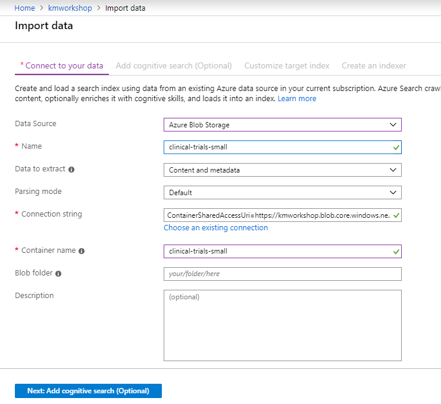
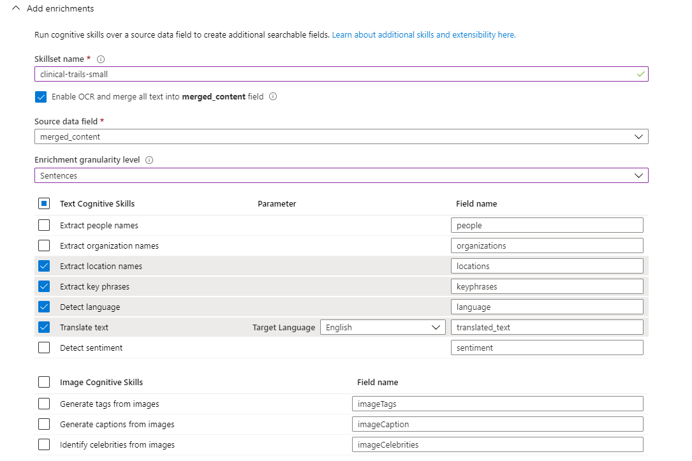
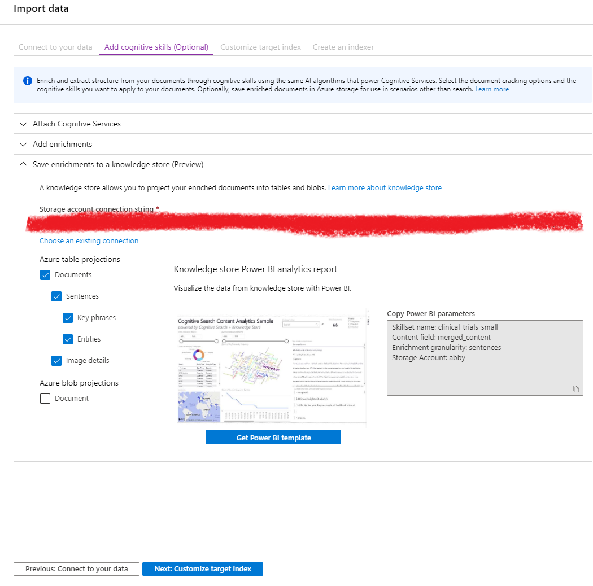
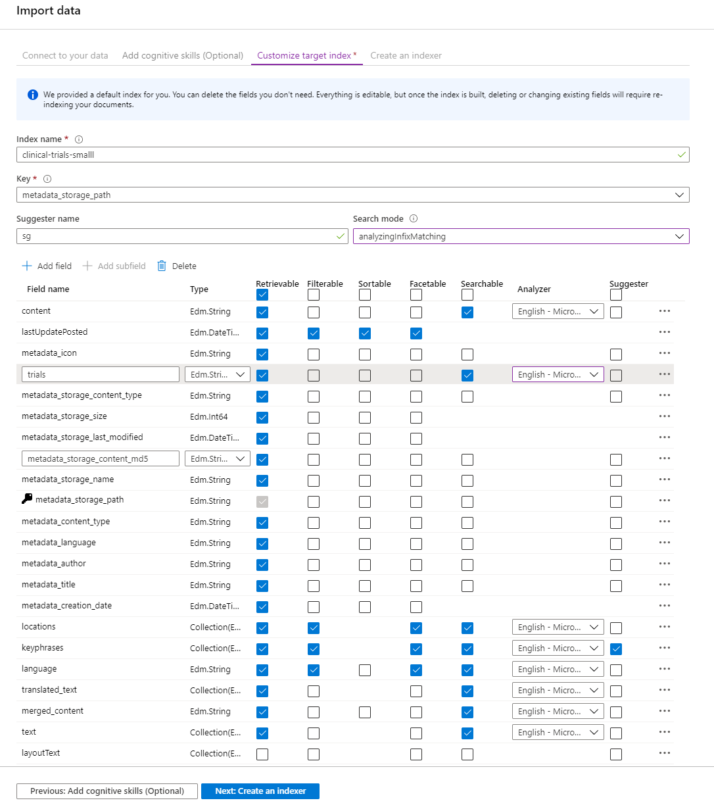
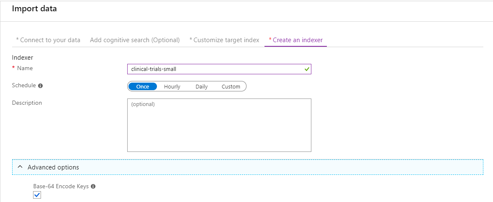
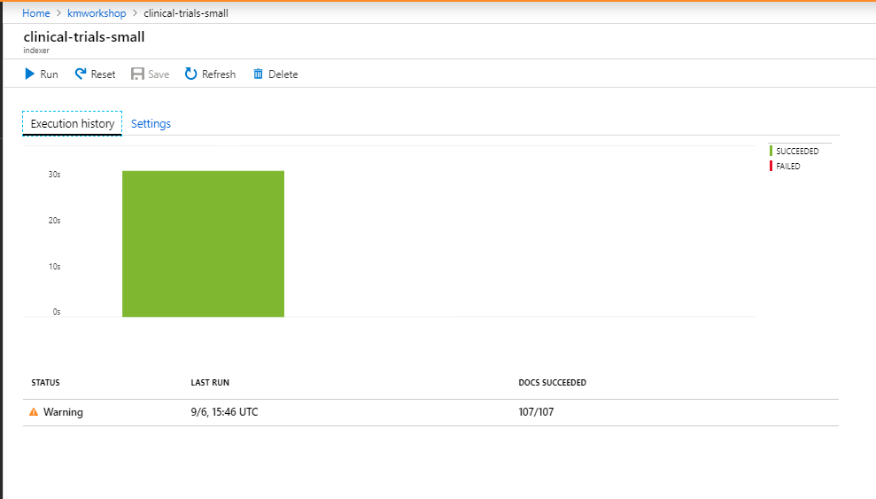

# Module 1: Using Azure Portal to Create Your Index - No Code Required

This module uses the Azure Portal to create your first Azure Cognitive Search index without writing any code.  Following these steps you will: ingest a set of files (clinical-trials); extract both structured and unstructured text from those files; index their content and learn how to query your new index.  Finally, we'll use the Azure Portal to project enriched data into a Knowledge Store (new Preview capability), which we'll use as part of our PowerBI exercise at the end of this lab.

## Using the Portal Import Data Flow:

1. Open the Azure Portal, navigate to your Search service, and click the **Import Data** button. This will launch the Import Data Wizard which will guide you through the steps necessary to ingest your data, enrich it and create a search indexer.

   
 
1. As part of the Import Data Wizard, in the **Connect to your data** tab, you can enter the information necessary to connect to your data source.

+ In the drop down for **Data Source**, choose *Azure Blob Storage*.

+ **Name** your data source *clinical-trials-small*.

+ Set **Data to Extract** to *Content and Metadata*

+ For the **Connection String** click *Choose an existing connection* and select your storage account. Select the *clinical-trials-small* container.

    + If you're not able to find the storage account you want to use by selecting *Choose an existing connection* you can always manually add the connection string. To get your connection string, view your storage account in the Azure Portal, select *Access keys* and copy the *Connection String*. Paste this as the *Connection string*. Then add the *Container name* which will be *clinical-trials-small*.
 
   Your screen should now look similar to this:

   

+ Now click **Next** to apply cognitive skills to your data.

## Skillset

In Azure Cognitive Search, we call extraction and enrichment steps cognitive skills, which are combined into a skillset referenced during indexing.  In this exercise, you will be learning how to use the [built-in skills](https://docs.microsoft.com/en-us/azure/search/cognitive-search-predefined-skills) through the Azure Portal.  In a later module, we will show you how to view and modify the Skillset Definition (JSON) right in the Azure Portal.

In the next three steps, you will be working through the three drop-down arrows presented: 

### Attach the Cognitive Services 

This is the resource you created earlier as part of your initial lab set up and is used to power your pre-built AI models.

### Set the Enrichment Granularity Level

We have made it easy for you to select the level of granularity you want to use to extract your enrichments.  In most cases, the default level of Source field is quite sufficient, however in cases where you have an extremely long document, or need to extract data (such as sentiment or language translation) you may get better results by adjusting the granularity to another level.  In the case, we will be using **Sentence** level granularity for our data extraction.

### Add enrichments

Name your skillset: *clinical-trials-small*

+ Make sure to select the **OCR enrichment** to extract **merged_content** field.

+ Now we can apply an enrichment to the merged_content field to extract data for locations, key phrases, language and text translation. Do this by checking **Extract location names**, **Extract key phrases**, **Detect language** and **Translate Text**.

+ Leave all of the other enrichment boxes blank at this time as we will add in additional skills later in the lab.

   

### Save enrichments to a knowledge store (Preview) 
The knowledge store is a new capability that we introduced into Public Preview in May.  Using the Knowledge Store enables you to use your data in scenarios that do not lend themselves naturally to search.  Once your data has been loaded into the Knowledge Store, you can do things like kick off RPA, run analytics or visualize in tools like PowerBI.

Projections are your mechanism for structuring data in a knowledge store. For example, through projections, you can choose whether output is saved as a single blob or a collection of related tables. An easy way to view knowledge store contents is through the built-in Storage Explorer for Azure storage.

The knowledge store supports two types of projections:

 + Tables: For data that is best represented as rows and columns, table projections allow you to define a schematized shape or projection in Table storage.

 + Objects: When you need a JSON representation of your data and enrichments, object projections are saved as blobs.

For this case, we are going to use Azure table projections 

We're going to go ahead and create the Knowledge Store now through the Azure Portal and will come back to the visualizations later in the lab.

1. Under **Azure table projections**, make sure *Documents*, *Sentences*, *Key Phrases*, *Entities*, and *Image details* have been selected. 
2. Click *choose an existing connection* and select your storage account.
3. Click on **+ Container** to create a new container called *clinical-trials-small-ks*.
4. **Select** the container created in the above step.

2. Click **Next: Customize the target index**.

## Index Definition
In this step, you are designing your Azure Cognitive Search index.  This is an important and powerful part of the index build process as you select the types of Analyzer(s) you want to use and make determinations on features such as which fields and data will be retrievable, filterable, sortable, and searchable. 

1. Give your index a name like *clinical-trials-small*

2. Leave **Key** as the default option

3. Under **Suggester name** add sg and set **Search mode** to *analyzingInfixMatching*

4.	In the index definition fields:
      + Make sure all the fields are **retrievable**. 
      + Make sure the following fields are set to **retrievable and searchable**
         + content
         + trials
         + translated_text
         + merged_content
         + text
      + Make sure that the following fields are set to **retrievable / filterable/ facetable / searchable**.
         + locations
         + key phrases
         + language
      + Make sure that *lastUpdatePosted* is set to **retrievable / filterable / sortable / facetable**
      + Set **English-Microsoft** as the *Analyzer* for all searchable fields since the content is in English.
      + Select **Suggester** for *keyphrases*
      + You can make layoutText not searchable/retrievable since we won’t need it during this lab.

      

   5. Click on **Next: Create an indexer**.

##  Indexer Definition

1. Name the indexer *clinical-trials-small* .
2. Set the **Schedule** to Once
3. Click on the **Advanced options** drop down and note that that the index key is Base-64 encoded by default.
 
   

4. Click on **Submit**. Then wait 2 or 3 minutes or so for the indexing to occur – then go check the status of your indexer on the portal.  
 
   

   

## Searching the Content
Now that the content has been indexed, we can use the portal to test some search queries.  For the purposes of this lab, we'll walk through one very quick example of this.  

Open the **Search explorer** and enter a search query such as "MPS" to allow us to find all document that refer to the disease MPS, and press "Search". Try adjusting the query with different phrases and terms to get an idea of the content.
 
 
 
 If you'd like to explore more on this topic, you can find additional examples of search queries in **Module 1** of the [KM Workshop](https://github.com/Azure-Samples/azure-search-knowledge-mining/blob/master/workshops/Module%201.md) as well as examples of how to use Postman to explore your index.
 
### Next: [Module 2: Visualizing the Results](Module&#32;2.md)
