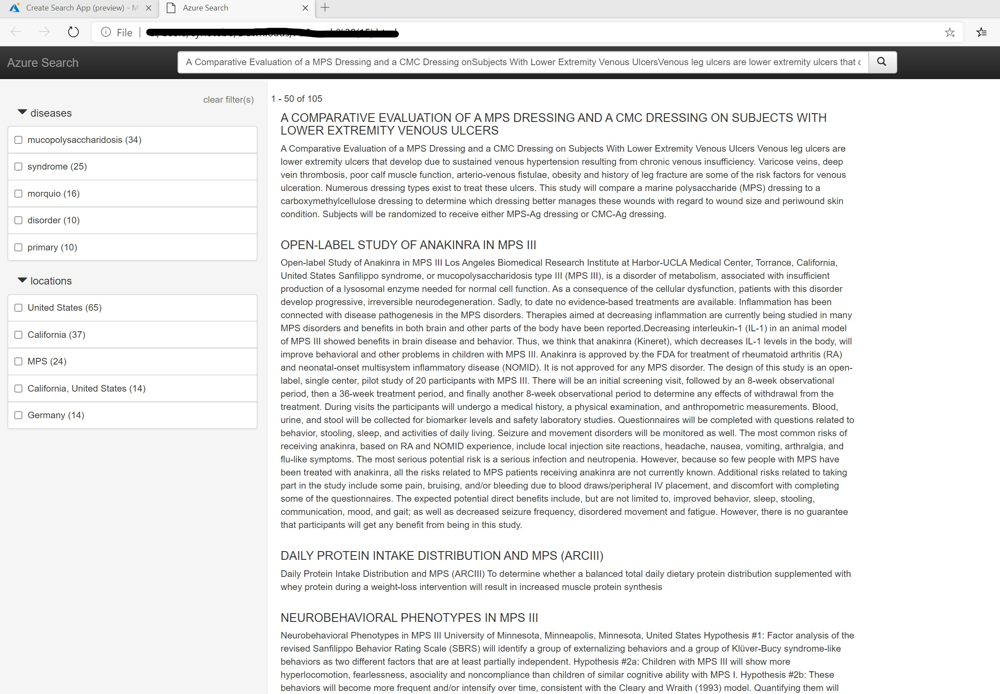

# Azure Cognitive Search: From 0 to MVP in Under an Hour

**Welcome to the Ready Technical Lab for Azure Cognitve Search!** 

The main focus of this lab is to demonstrate some of the new capabilities now available in the Azure Portal that enable you to build a end to end Knowledge Mining solution with Azure Cognitive Search.  No more flipping between multiple tools like Visual Studio and Postman, now you can have a working end to end solution, using your own data, built without ever leaving the Azure Portal.  These capabilities allow just about anyone to quickly and easily stand up a customer ready MVP or Demo, and set up the necessary components needed to move forward with development of a production ready solution.

During this lab, we will be exploring a data set that is comprised of clinical trials in PDF format.  This demo data set contains over 100 records which contain complex medical terms and disease information in an unstructured format - meaning that there is no easy way to search the data set for information or records that pertain to a specific disease, like cirrhosis.  And worse yet, if (like the authors of this lab) you don't always accurately spell cirrhosis, you may have no way of ever finding the information you're looking for - structured or otherwise.

The challenge is, how can you take a vast amount of unstructured content and all of the latent data that it contains and provide an easy and effective way for a human to find the information that is most meaningful and relevant to them in the most efficient means possible?  Metaphorically, we are going to be finding meaning in information that starts out looking like this:

This is where the power of Knowledge Mining with Azure Cognitive Search comes to the rescue.  Using the skills and techniques we'll be teaching you today, you will be able to quickly and easily ingest this content, learn how to add and modify powerful skills, such as custom entity lookup and PII extraction, to identify and extract specific medical terms related to disease conditions.  You will be visualizing these results using the Azure Search App tool (a basic web front end).

+ *Note: The Azure Search App Tool is for demonstration purposes only and should not be used for Production deployment*.

or project the data into powerful visuals  you create in PowerBI.  

At the end of this 60 minute lab, you'll have learned how to use Azure Cognitive Search to build a fully searchable medical repository that will allow users to find and extract really powerful information without ever leaving the Azure Portal.  

We will also provide you links to additional resources and tools that can be used to further enhance and extend your MVP to build a truely robust search solution for your customers.  We encourage you to walk through these materials on your own time to learn how these capabilities can be leveraged to suit any customers business needs.

+ *Note: Please make sure to complete all of pre-requisites listed in Module 0 before moving on, as you will not be able to complete the exercises in this lab without them*.

## Agenda

+ [Module 0 - Pre-Requisites](./Module%200.md) (*only required if not taking this lab as part of Winter Ready*)
+ [Module 1 - Using Azure Portal to Create your Index - No Code Required](./Module%201.md)
+ [Module 2 - Visualizing the Results with the Create Search App](./Module%202.md)
+ [Module 3 - Using the Azure Portal to Iterate on Your Solution](./Module%203.md)
+ [Module 4 - Optional- Analyzing extracted data with PowerBI](./Module%204.md)

If you are interested in learning more about developing with Azure Cognitive Search, feel free to take our extended [Knowledge Mining Workshop](https://github.com/Azure-Samples/azure-search-knowledge-mining/tree/master/workshops).  This workshop will take you more deeply into the developer tools used and key concepts which are fundemental to building a Knowledge Mining solution with Azure Cognitive Search and should take between 4 and 6 hours to complete.
